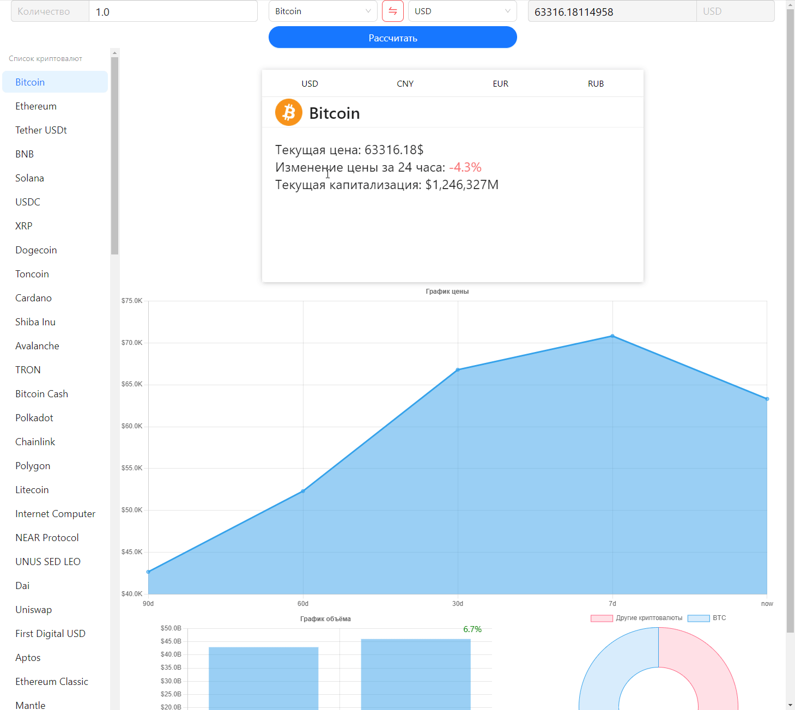

<h1 align="center">Cкринер криптовалют</h1>

***

### Стек:
#### Backend

>
>
>
>
>
>

#### Frontend

>
>
>
>
>
>
>
>
>

***

***

Интерфейс приложения позволяет получать информацию о 100 наиболее ликвидных криптовалютах. Запрос с **frontend** идёт на 
___uvicorn___, где запущено приложение на ___FastAPI___. Затем **backend** отправляет запрос через ___AIOHTTP___ на
стороннее **API** ___CoinMarketCup___ и кешируются ___lru___ для моментального ответа сервера, а так же для уменьшения 
нагрузок на сеть, а так же не расходовать количество запросов к стороннему **API**. 
Далее передаёт ответ **json объект** в ___JavaScript___.

При выборе конкретной криптовалюты из списка меню, выводится подробная информация о цене, капитализации, изменений цен
и объёмов. Имеется опция конвертации и выводе цены в конкретной фиатной валюте **($, €, ¥, ₽)** . Так же с **backend** 
в этот момент идёт запрос данных для построения графика. Так как ___CoinMarketCup___ возвращает только процентное 
изменение цены, то класс _Graph_ пересчитывает эти данные в _"плоские"_ числа. Затем уже по этим данным 
___react-chartjs-2___ отстраивает 3 графика: (График цены за 90 дней, график суточных объёмов текущих и прошлых,
График доминирования выбранной криптовалюты на рынке).

Интерфейс позволяет проводить конвертацию криптовалюты в фиатную валюту и наоборот. Функция поддерживает выбор всех 
криптовалют из меню, и 4 фиатные валюты **($, €, ¥, ₽)**

